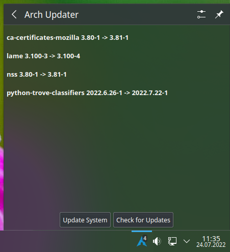
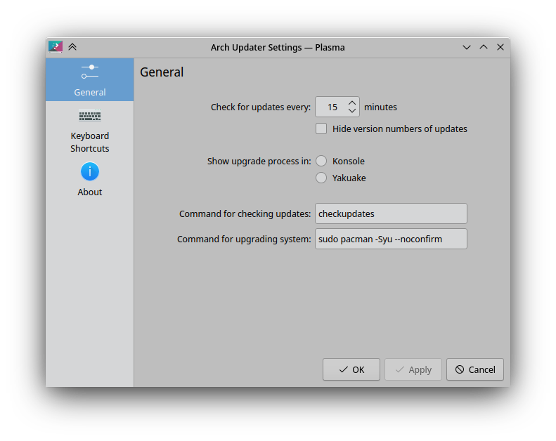

# KDE Plasmoid Arch Linux Updates Notification

A KDE plasmoid for your system tray that notifies you of available updates for your Arch Linux System

In your system tray:

Full Representation:

Settings:

## Requires:

- Arch Linux
- KDE desktop environment
- base-devel
- cmake
- extra-cmake-modules
- make
- pacman-contrib
- gcc
- konsole

## How to install

    cd pkg
    makepkg -si

- right click task bar
- select panel options
- select add widget
- double click arch updater
